# OpenSees Example Benchmarks

<!-- Auto-generated by scripts/plot_markdown_benchmarks.py -->

## ex1

```mermaid
---
config:
  themeVariables:
    xyChart:
      plotColorPalette: '#1f77b4, #FF5A1F, #d0d0d0'
---
xychart-beta
    title "Benchmark: Example 1"
    x-axis ["1O", "1S", "1-", "2O", "2S", "2-", "3O", "3S", "3-", "4O", "4S"]
    y-axis "Analysis time (ms)" 0 --> 5.465
    bar "OS" [2.031, 0.0, 0.0, 3.908, 0.0, 0.0, 4.040, 0.0, 0.0, 0.623, 0.0]
    bar "STR" [0.0, 0.420, 0.0, 0.0, 4.968, 0.0, 0.0, 0.848, 0.0, 0.0, 1.287]
    bar "mask" [0.0, 0.0, 0.0, 0.0, 0.0, 0.0, 0.0, 0.0, 0.0, 0.0, 0.0]
```

| # | Label | OpenSees (ms) | Strut (ms) |
| ---: | --- | ---: | ---: |
| 1 | `ex1a_canti2d_eq` | 2.031 | 0.420 |
| 2 | `ex1a_canti2d_push` | 3.908 | 4.968 |
| 3 | `ex1b_portal2d_eq` | 4.040 | 0.848 |
| 4 | `ex1b_portal2d_push` | 0.623 | 1.287 |

## ex2

```mermaid
---
config:
  themeVariables:
    xyChart:
      plotColorPalette: '#1f77b4, #FF5A1F, #d0d0d0'
---
xychart-beta
    title "Benchmark: Example 2"
    x-axis ["1O", "1S", "1-", "2O", "2S"]
    y-axis "Analysis time (ms)" 0 --> 40.474
    bar "OS" [3.295, 0.0, 0.0, 17.635, 0.0]
    bar "STR" [0.0, 3.770, 0.0, 0.0, 36.794]
    bar "mask" [0.0, 0.0, 0.0, 0.0, 0.0]
```

| # | Label | OpenSees (ms) | Strut (ms) |
| ---: | --- | ---: | ---: |
| 1 | `ex2b_canti2d_inelasticsection_eq` | 3.295 | 3.770 |
| 2 | `ex2c_canti2d_inelastic_fiber` | 17.635 | 36.794 |

## ex3

```mermaid
---
config:
  themeVariables:
    xyChart:
      plotColorPalette: '#1f77b4, #FF5A1F, #d0d0d0'
---
xychart-beta
    title "Benchmark: Example 3"
    x-axis ["1O", "1S", "1-", "2O", "2S", "2-", "3O", "3S", "3-", "4O", "4S"]
    y-axis "Analysis time (ms)" 0 --> 48.110
    bar "OS" [19.006, 0.0, 0.0, 0.072, 0.0, 0.0, 0.553, 0.0, 0.0, 0.033, 0.0]
    bar "STR" [0.0, 43.736, 0.0, 0.0, 0.095, 0.0, 0.0, 0.812, 0.0, 0.0, 0.105]
    bar "mask" [0.0, 0.0, 0.0, 0.0, 0.0, 0.0, 0.0, 0.0, 0.0, 0.0, 0.0]
```

| # | Label | OpenSees (ms) | Strut (ms) |
| ---: | --- | ---: | ---: |
| 1 | `analyze_dynamic_eq_uniform` | 19.006 | 43.736 |
| 2 | `build_elasticelement` | 0.072 | 0.095 |
| 3 | `build_inelasticfibersection` | 0.553 | 0.812 |
| 4 | `build_inelasticsection` | 0.033 | 0.105 |

## ex4

```mermaid
---
config:
  themeVariables:
    xyChart:
      plotColorPalette: '#1f77b4, #FF5A1F, #d0d0d0'
---
xychart-beta
    title "Benchmark: Example 4"
    x-axis ["1O", "1S", "1-", "2O", "2S", "2-", "3O", "3S", "3-", "4O", "4S", "4-", "5O", "5S"]
    y-axis "Analysis time (ms)" 0 --> 115.158
    bar "OS" [45.111, 0.0, 0.0, 77.250, 0.0, 0.0, 0.045, 0.0, 0.0, 1.200, 0.0, 0.0, 0.115, 0.0]
    bar "STR" [0.0, 87.358, 0.0, 0.0, 104.689, 0.0, 0.0, 0.153, 0.0, 0.0, 1.113, 0.0, 0.0, 0.159]
    bar "mask" [0.0, 0.0, 0.0, 0.0, 0.0, 0.0, 0.0, 0.0, 0.0, 0.0, 0.0, 0.0, 0.0, 0.0]
```

| # | Label | OpenSees (ms) | Strut (ms) |
| ---: | --- | ---: | ---: |
| 1 | `analyze_dynamic_eq_uniform` | 45.111 | 87.358 |
| 2 | `analyze_dynamic_sine_uniform` | 77.250 | 104.689 |
| 3 | `build_elasticelement` | 0.045 | 0.153 |
| 4 | `build_inelasticfibersection` | 1.200 | 1.113 |
| 5 | `build_inelasticsection` | 0.115 | 0.159 |

## ex5

```mermaid
---
config:
  themeVariables:
    xyChart:
      plotColorPalette: '#1f77b4, #FF5A1F, #d0d0d0'
---
xychart-beta
    title "Benchmark: Example 5"
    x-axis ["1O", "1S", "1-", "2O", "2S", "2-", "3O", "3S", "3-", "4O", "4S", "4-", "5O", "5S", "5-", "6O", "6S", "6-", "7O", "7S", "7-", "8O", "8S", "8-", "9O", "9S"]
    y-axis "Analysis time (s)" 0 --> 8.621
    bar "OS" [2.364, 0.0, 0.0, 2.015, 0.0, 0.0, 2.184, 0.0, 0.0, 7.837, 0.0, 0.0, 0.001, 0.0, 0.0, 0.065, 0.0, 0.0, 0.010, 0.0, 0.0, 0.001, 0.0, 0.0, 3.806, 0.0]
    bar "STR" [0.0, 1.068, 0.0, 0.0, 1.012, 0.0, 0.0, 1.135, 0.0, 0.0, 5.954, 0.0, 0.0, 0.001, 0.0, 0.0, 0.028, 0.0, 0.0, 0.009, 0.0, 0.0, 0.001, 0.0, 0.0, 2.197]
    bar "mask" [0.0, 0.0, 0.0, 0.0, 0.0, 0.0, 0.0, 0.0, 0.0, 0.0, 0.0, 0.0, 0.0, 0.0, 0.0, 0.0, 0.0, 0.0, 0.0, 0.0, 0.0, 0.0, 0.0, 0.0, 0.0, 0.0]
```

| # | Label | OpenSees (s) | Strut (s) |
| ---: | --- | ---: | ---: |
| 1 | `analyze_dynamic_eq_bidirect` | 2.364 | 1.068 |
| 2 | `analyze_dynamic_eq_multiplesupport` | 2.015 | 1.012 |
| 3 | `analyze_dynamic_sine_multiplesupport` | 2.184 | 1.135 |
| 4 | `analyze_dynamic_sine_uniform` | 7.837 | 5.954 |
| 5 | `build_elasticsection` | 0.001 | 0.001 |
| 6 | `build_inelasticfiberrcsection` | 0.065 | 0.028 |
| 7 | `build_inelasticfiberwsection` | 0.010 | 0.009 |
| 8 | `build_inelasticsection` | 0.001 | 0.001 |
| 9 | `eq_uniform_rc_fiber` | 3.806 | 2.197 |

## ex6

```mermaid
---
config:
  themeVariables:
    xyChart:
      plotColorPalette: '#1f77b4, #FF5A1F, #d0d0d0'
---
xychart-beta
    title "Benchmark: Example 6"
    x-axis ["1O", "1S", "1-", "2O", "2S", "2-", "3O", "3S", "3-", "4O", "4S", "4-", "5O", "5S", "5-", "6O", "6S", "6-", "7O", "7S", "7-", "8O", "8S"]
    y-axis "Analysis time (s)" 0 --> 3.935
    bar "OS" [1.845, 0.0, 0.0, 2.272, 0.0, 0.0, 3.577, 0.0, 0.0, 2.006, 0.0, 0.0, 0.001, 0.0, 0.0, 0.057, 0.0, 0.0, 0.010, 0.0, 0.0, 0.001, 0.0]
    bar "STR" [0.0, 0.971, 0.0, 0.0, 0.951, 0.0, 0.0, 2.305, 0.0, 0.0, 0.956, 0.0, 0.0, 0.001, 0.0, 0.0, 0.027, 0.0, 0.0, 0.009, 0.0, 0.0, 0.001]
    bar "mask" [0.0, 0.0, 0.0, 0.0, 0.0, 0.0, 0.0, 0.0, 0.0, 0.0, 0.0, 0.0, 0.0, 0.0, 0.0, 0.0, 0.0, 0.0, 0.0, 0.0, 0.0, 0.0, 0.0]
```

| # | Label | OpenSees (s) | Strut (s) |
| ---: | --- | ---: | ---: |
| 1 | `analyze_dynamic_eq_bidirect` | 1.845 | 0.971 |
| 2 | `analyze_dynamic_eq_multiplesupport` | 2.272 | 0.951 |
| 3 | `analyze_dynamic_eq_uniform` | 3.577 | 2.305 |
| 4 | `analyze_dynamic_sine_multiplesupport` | 2.006 | 0.956 |
| 5 | `build_elasticsection` | 0.001 | 0.001 |
| 6 | `build_inelasticfiberrcsection` | 0.057 | 0.027 |
| 7 | `build_inelasticfiberwsection` | 0.010 | 0.009 |
| 8 | `build_inelasticsection` | 0.001 | 0.001 |
